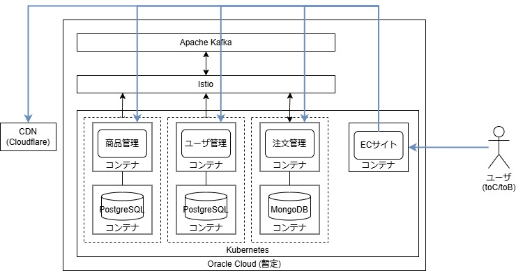

# マイクロサービスなECサイト(デモ)
## 目次
- [背景](#背景)
- [最低限満たしておきたい要件](#最低限満たしておきたい要件)
  - [機能面](#機能面)
  - [運用面](#運用面)
- [技術選定](#技術選定)
- [設計](#設計)
- [課題](#課題)

## 背景
- バックエンドエンジニアとして転職を目指したい
- 不足感のあるスキルを補う
- スキルの網羅感のあるテーマとしてECサイトが最適と判断

## 最低限満たしておきたい要件
粒度が異なるが、以下を網羅しておきたい。

### 機能面
- CRUD, 認証, RESTful API等の基本的な機能
- CDNによるコンテンツ配信(商品画像など)
- HTTP/3やNoSQLなど比較的最近の技術のキャッチアップ
- マイクロサービスでのサービス展開

### 運用面
- k8sでのクラスタリング
- GCP, AWS, OCIなどいずれかでのホスティング
- CI/CDツールによる自動化

## 技術選定
- 言語/フレームワーク
  - Java / Spring Boot
- DB
  - RDBMS: PostgreSQL
  - NoSQL: MongoDB
- インフラ
  - ホスティング: ```未定```
  - DNS: Cloudflare
  - CDN: Cloudflare
  - 仮想化: Docker
  - クラスタ: Kubernetes
- マイクロサービス
  - API Gateway: Istio
  - メッセージング: Kafka


## 設計
詳細は[Doc](./doc/index.md)を参照
### システム構成


## 課題
- 認証・認可周り
  - マイクロサービス間
  - マイクロサービス/ユーザ間