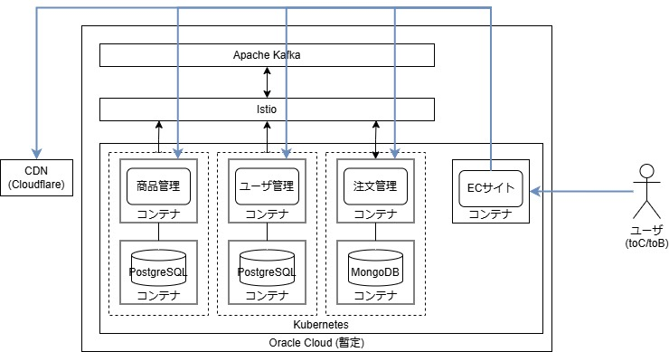

# 基本設計書

## システム構成


## 機能一覧
### 前提
- 各種機能はAPIから呼び出す
- 原則、更新(DBのテーブル更新)は行わない
- 更新=新規作成として旧データを残しておき、最新のデータを取得することで更新機能を実現する
  - 理由
    - 実装のシンプル化
    - イミュータブルデータモデルの実践  
    参考: [「イミュータブルデータモデル(入門編)」slideshare](https://www.slideshare.net/slideshow/ss-40471672/40471672)
### API
```toCユーザ: 商品の購入等を行うユーザ```  
```toBユーザ: 商品の販売等を行うユーザ（店舗）```

#### API一覧
| API名称 | 英名              | 概要                | 補足                                               |
|-------|-----------------|-------------------|--------------------------------------------------|
| ユーザ管理 | User API        | ユーザ/店舗情報に関する機能を提供 |                                                  |
| 商品管理  | Merchandise API | 商品/在庫に関する機能を提供    |                                                  |
| 商品検索  | Search API      | 商品の検索に関する機能を提供    | Elasticsearchによる以下機能を提供<br/>- あいまい検索<br/>- サジェスト |
| 注文管理  | Order API       | 商品の注文/受注に関する機能を提供 |                                                  |

- ユーザ管理 (User API)
- 商品管理 (Merchandise API)
- 商品検索 (Search API)
  - Elasticsearchによる高速検索とサジェスト機能を提供
- 注文管理 (Order API)
#### API機能一覧
| API   | 対象     | 機能   | C | R | U | D |
|-------|--------|------|---|---|---|---|
| ユーザ管理 | toCユーザ | 会員   | o | o | o |   |
|       | toBユーザ | 店舗   | o | o | o |   |
| 商品管理  | toCユーザ | 商品   |   | o |   |   |
|       | toBユーザ | 商品   | o | o | o | o |
| 商品検索  | toCユーザ | 商品検索 |   | o |   |   |
| 注文管理  | toCユーザ | カート  |   | o | o |   |
|       |        | 注文   | o | o | o |   |
|       |        | 決済   | o |   | o |   |
|       | toBユーザ | 受注   |   | o | o |   |
